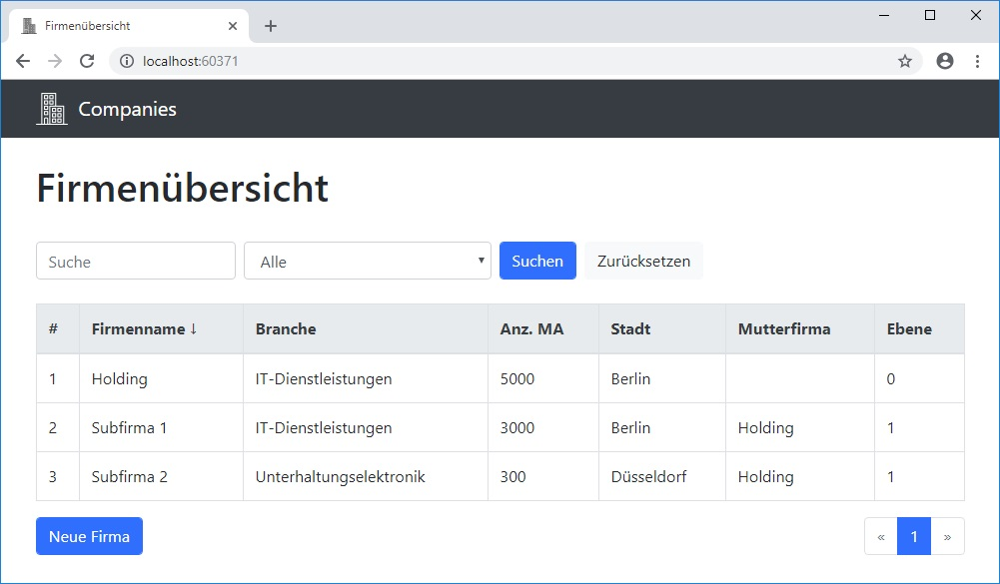

# Companies
Simple web application for managing companies hierarchy structures based on **ASP.NET Core MVC** (Version 2.2), EF Core and Bootstrap. Includes CRUD operations, sorting, filtering, searching and pagination.

## Screenshot

## Todos
- Items auf Pagesize kürzen besser in Db statt im Speicher
- Sort desc/asc anbieten
- Pages-Anzeige kürzen wenn >5
- UX von Tabelle für Mobil
- UX von Formular für Breitbild
- Code-Kommentare
- Alphabetische Sortierung
- HTML clutter verschönern, z.B. durch weitere TagHelper